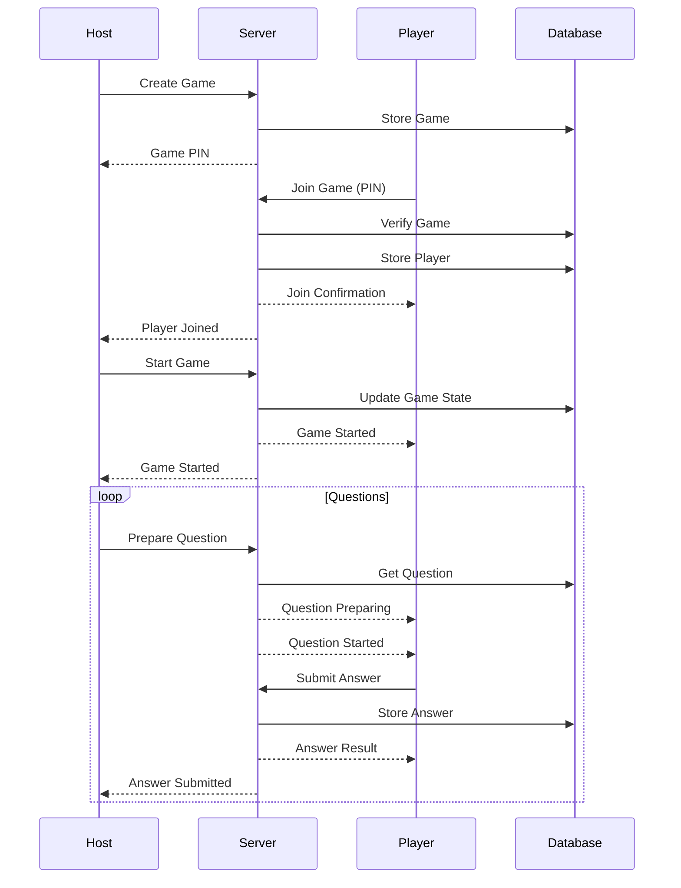
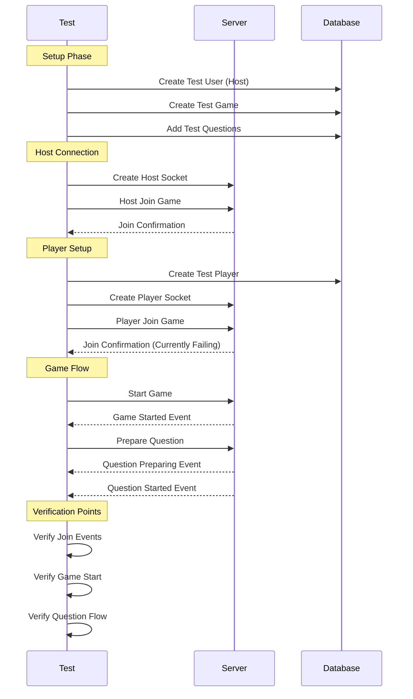
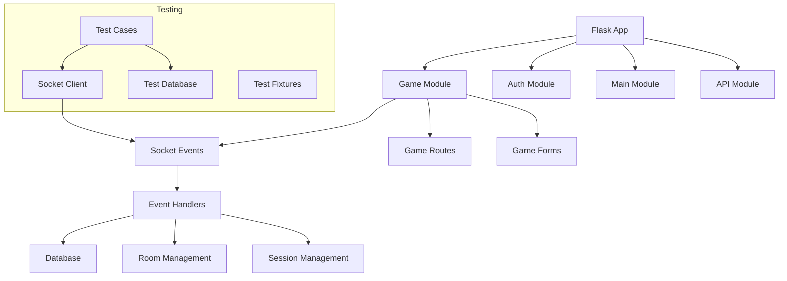
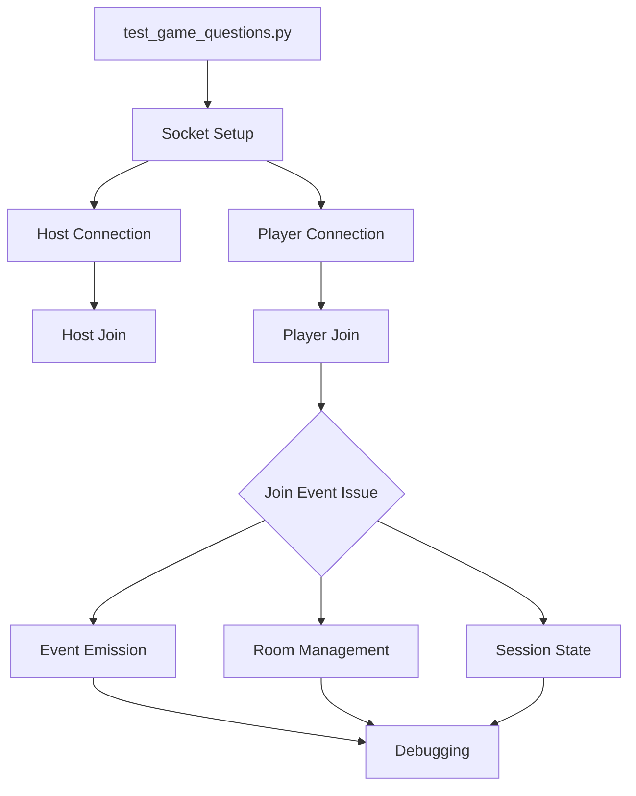

# System Architecture and Flow Diagrams

## Game Flow



## Test Flow



## Component Architecture



## Current Testing Focus



## Event Flow (Current Issue)

```mermaid
sequenceDiagram
    participant Test
    participant Server
    participant Room
    participant Session

    Test->>Server: Player Join Request
    Server->>Session: Set Session Data
    Server->>Room: Join Room
    Server--xTest: Player Joined Event (Missing)
    Note over Server,Test: Event not reaching test client
