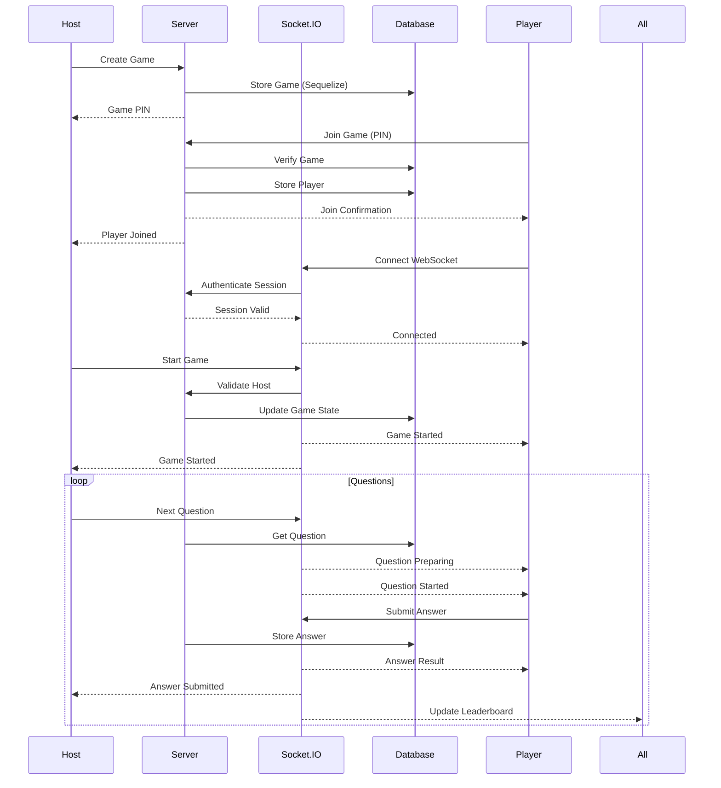
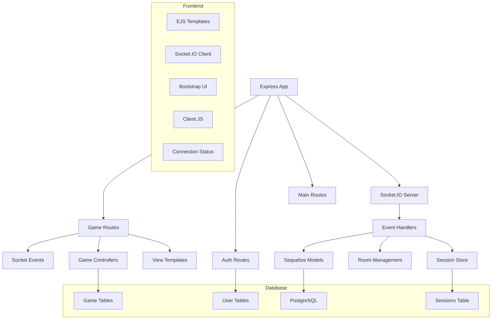
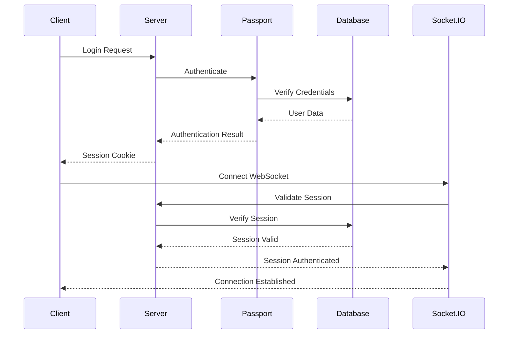
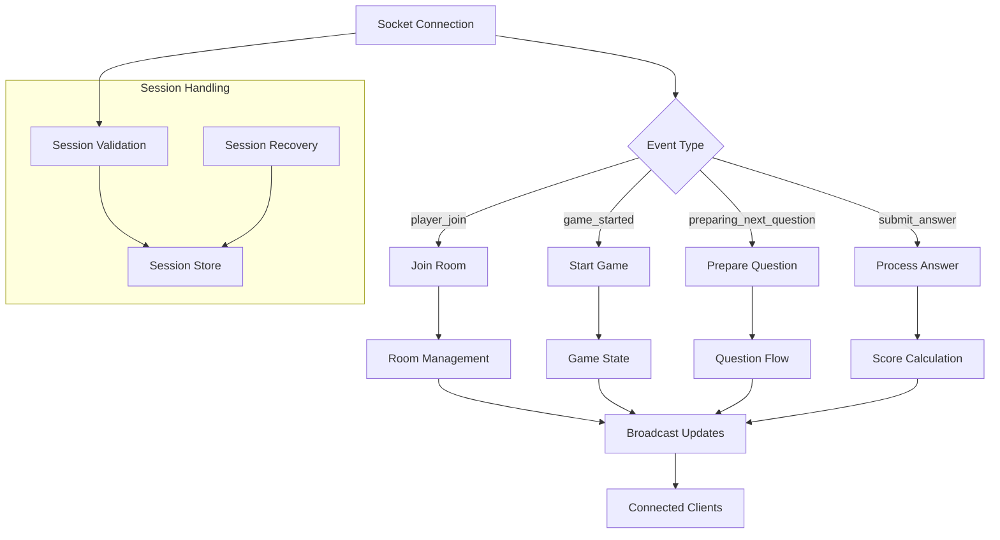

# System Architecture and Flow Diagrams

## Game Flow



## Component Architecture



## Authentication Flow



## Socket.IO Event Flow



## Data Models

```mermaid
erDiagram
    User ||--o{ Game : hosts
    Game ||--o{ Question : contains
    Game ||--o{ Player : has
    Player ||--o{ Answer : submits
    Question ||--o{ Answer : receives
    Session ||--o{ User : authenticates

    User {
        int id PK
        string username
        string email
        string password
        datetime created_at
        datetime updated_at
    }

    Game {
        int id PK
        string pin
        int host_id FK
        bool is_active
        datetime started_at
        datetime ended_at
        int current_question_index
        datetime current_question_started_at
        datetime created_at
        datetime updated_at
    }

    Question {
        int id PK
        int game_id FK
        text content
        string correct_answer
        json incorrect_answers
        int time_limit
        int points
        datetime created_at
        datetime updated_at
    }

    Player {
        int id PK
        int game_id FK
        string nickname
        int score
        int current_streak
        bool is_ready
        datetime created_at
        datetime updated_at
    }

    Answer {
        int id PK
        int player_id FK
        int question_id FK
        string answer_text
        bool is_correct
        float response_time
        int points_awarded
        datetime created_at
        datetime updated_at
    }

    Session {
        string id PK
        json data
        datetime expires
        datetime created_at
        datetime updated_at
    }
